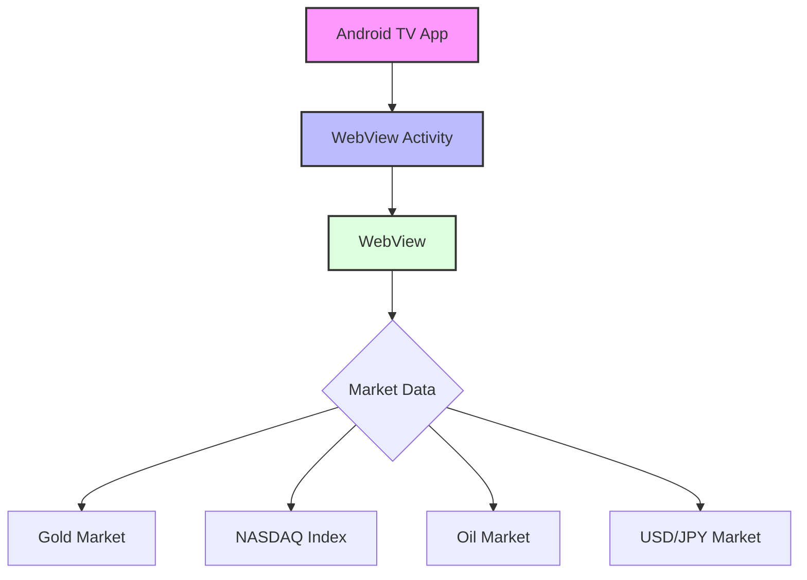

# Android TV 行情展示应用

## 项目概述
这是一个基于Android TV平台的行情数据展示应用。该应用主要通过WebView加载不同的行情数据页面，支持多个市场品种的行情展示，包括：
- 黄金行情 (XAUUSD)
- 纳斯达克指数
- 原油行情
- 美日汇率行情

## 技术栈
- 开发语言：Kotlin
- 最低支持Android API：26
- 目标Android API：34
- 构建工具：Gradle 8.4.0
- 主要依赖：
  - AndroidX Core KTX
  - AndroidX AppCompat
  - Material Design Components
  - Leanback (Android TV支持库)
  - Glide (图片加载)

## 系统架构

## 功能特点
1. **多市场支持**：通过产品变体(Product Flavors)支持不同的市场数据展示
2. **TV优化**：
   - 支持TV Leanback启动器
   - 不要求触摸屏支持
   - 针对TV界面优化的主题
3. **网络功能**：
   - 支持HTTPS/HTTP访问
   - 支持JavaScript执行
   - 支持DOM存储
4. **性能优化**：
   - WebView硬件加速
   - 针对TV平台的UI优化

## 构建变体
应用支持多个构建变体，每个变体对应不同的市场：

| 变体名称 | 包名 | 应用名称 | 数据源 |
|---------|------|---------|--------|
| gold | com.cmcc.xauusd | 黄金行情 | https://mt5.gslb.vip/mt/xauusd.html |
| nasdaq | com.cmcc.index | 纳斯达克指数 | https://mt5.gslb.vip/mt/index.html |
| oil | com.cmcc.usoil | 原油 | https://mt5.gslb.vip/mt/usoil.html |
| usdjpy | com.cmcc.usdjpy | 美日行情 | https://mt5.gslb.vip/mt/usdjpy.html |

## 安全性考虑
1. 签名配置：
   - 支持Release签名配置
   - CI环境下禁用签名
2. 混淆配置：
   - 默认未启用混淆
   - 保留WebView相关类

## 版本信息
- 当前版本：1.1.0
- 版本号：3
- 构建工具版本：8.4.0
- Kotlin版本：1.9.22 